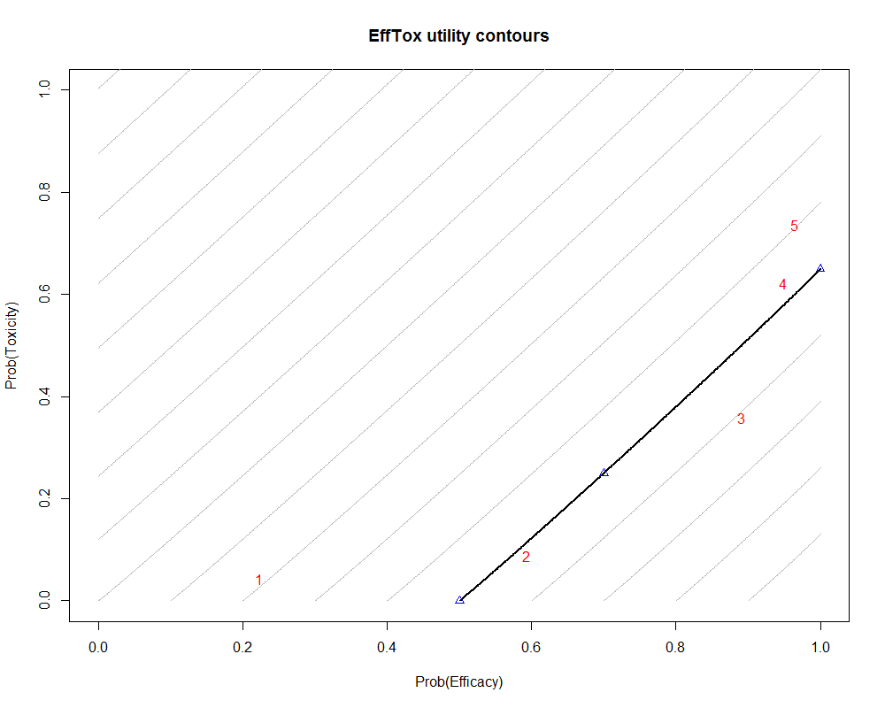
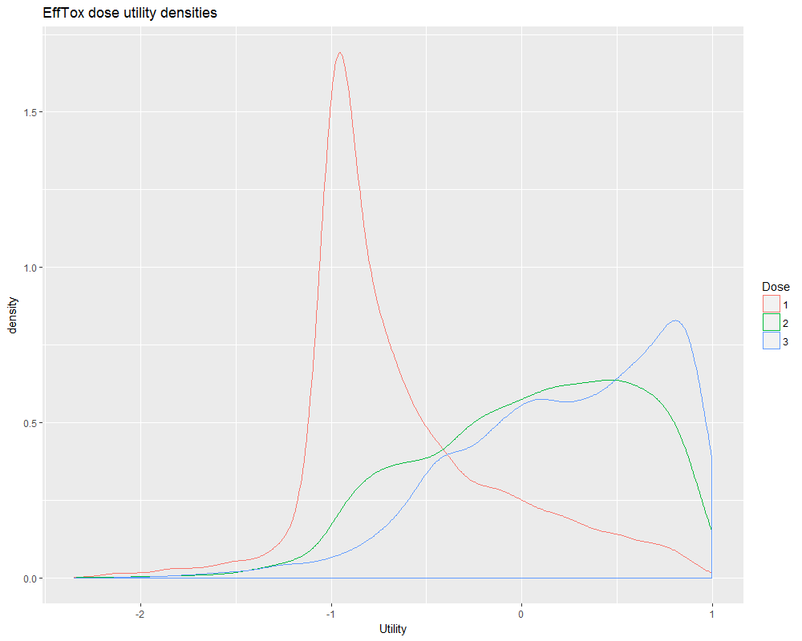

# trialr - Clinical Trial Designs in R & Stan

This R package implements clinical trial designs in R via RStan. 

RStan is the R connector of the [Stan](http://mc-stan.org/) project. Stan offers full Bayesian statistical inference so the designs implemented here tend to be Bayesian in nature. Furthermore, there is a preponderance of early-phase clinical trial designs because a) these are the designs that tend to use Bayesian methodology; and b) this is my research area.

Functions are provided to invoke a trial analysis on observed outcomes and perform simulations.

Trial designs currently implemented include:
- EffTox, by Thall &amp; Cook. 
- Hierarchical Bayesian model for binary response outcomes, by Thall et al. 
- Bayesian Evaluation of Bivariate Binary Outcomes with Predictive Information (BEBOP), by Brock et al.

## Usage

`library(trialr)`

### EffTox example

In a nutshell, Thall & Cook's EffTox is a dose-finding design that uses binary efficacy and toxicity outcomes to select a dose with a high utility score. Refer to _Dose-Finding Based on Efficacy-Toxicity Trade-Offs_ (Thall & Cook) and _Effective sample size for computing prior hyperparameters in Bayesian phase I-II dose-finding_ (Thall, Herrick, Nguyen, Venier & Norris).

Get parameters for EffTox model
`dat <- efftox_parameters_demo()`

Add outcomes for 3 patients: patient 1, treated at dose 1, has neither efficacy nor toxicity; patient 2, treated at dose 2, has just efficacy; and patients 3, treated at dose 3,  has both.

`dat$num_patients <- 3`

`dat$eff <- c(0, 1, 1)`

`dat$tox <- c(0, 0, 1)`

`dat$doses <- c(1, 2, 3)`

Invoke RStan posterior sampling on model and data. By installing `trialr`, the EffTox model is compiled on your system and made available for sampling via the `stanmodels` object.

`set.seed(123)`

`samp <- rstan::sampling(stanmodels$EffTox, data = dat)`

`decision <- efftox_process(dat, samp, p_e = 0.10, p_t = 0.10)`

`decision$recommended_dose  # 3 is the recommended dose-level`  

`round(decision$utility, 2)  #  -0.63  0.04  0.22 -0.07 -0.21`

Doses 3 has the highest utility score. Sometimes, doses other than the maximal-utility dose will be recommended because of the dose-admissibility rules. See the papers for details. 

Functions are provided to create useful plots. The five doses are shown in red. Doses closer to the lower-right corner have higher utility. 

`efftox_contour_plot(dat, prob_eff = decision$prob_eff, prob_tox = decision$prob_tox)`

`title('EffTox utility contours')`

Another way of viewing dose-utility is a density plot

`efftox_utility_density_plot(samp, doses = 1:3) + ggtitle("EffTox dose utility densities")`

From this plot, it is perhaps not obvious that dose 3 has higher expected utility than dose 2. That is an important inference in itself. 

## Installation

I will admit, getting trialr installed is not as simple as I'd like. This package relies on RStan, so that must be installed first. RStan relies on a C++ compiler being installed. 

### Windows

In my experience, the install sequence that works best is:

1. Install `Rtools`, to get a C++ compiler
2. Install `rstan`
3. Install `trialr`

#### Installing Rtools

Visit https://cran.r-project.org/bin/windows/Rtools/ and install for your version of R. I always try to use the newest version of everything to maximise chances that bugs have been fixed.

#### Installing rstan

This may be as simple as running 

`install.packages('rstan')`

This should install the many requisites for RStan too. Requirements include `stantools` and `Rcpp`. If you encounter problems, you should visit the [RStan quick start guide](https://github.com/stan-dev/rstan/wiki/RStan-Getting-Started) and follow the instructions for your platform. Further help will be available at the RStan homepage at [mc-stan.org](http://mc-stan.org/interfaces/rstan.html).

#### Install trialr

Eventually, I will add trialr to CRAN. However, in the meantime, you can install straight from GitHub.

If the devtools R package is not installed on your system, run `install.packages('devtools')`. 

Then run

`devtools::install_github('brockk/trialr')`

### Mac

TODO

### Linux

TODO

## Extending trialr and getting in touch

If there is a published Bayesian design you want implemented in Stan, get in touch.
Contact @brockk on GitHub

