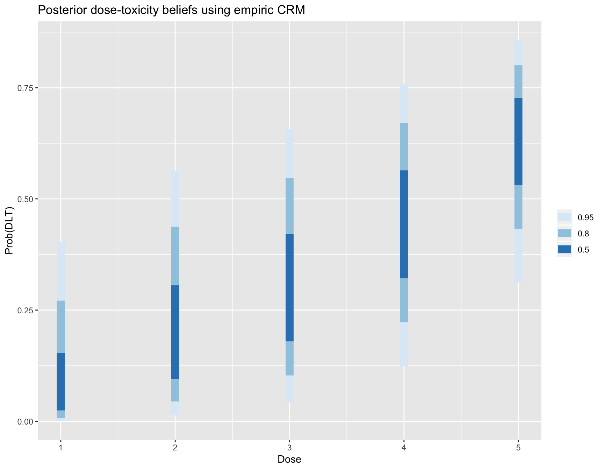
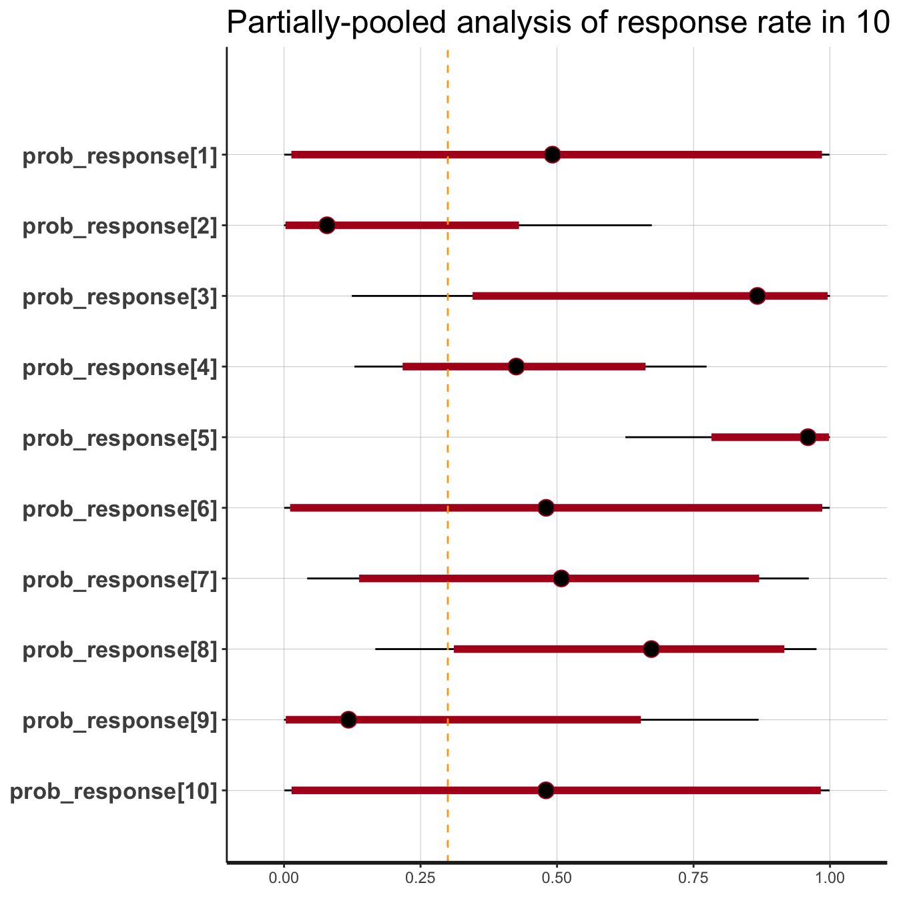

trialr - Clinical Trial Designs in `RStan`
================

<!-- README.md is generated from README.Rmd. Please edit that file -->

# trialr

`trialr` is a collection of Bayesian clinical trial designs implemented
in Stan and R. The documentation is available at
<https://brockk.github.io/trialr/>

Many notable Bayesian designs for clinical trials have been published.
However, one of the factors that has constrained their adoption is
availability of software. We present here some of the most popular,
implemented and demonstrated in a consistent style, leveraging the
powerful Stan environment.

It should be stressed that Bayesian trialists are not generally without
code. Often authors make available code with their design publication.
There are also some fantastic packages that aid the use of certain
designs. However, challenges to use still persist. The disparate methods
are naturally presented in a style that appeals to the particular
author. Features implemented in one package for one design may be
missing in another. Sometimes the technology chosen may only be
available on one particular operating system, or the chosen technology
may have fallen into disuse.

`trialr` seeks to address these problems. Models are specified in
[Stan](http://mc-stan.org/), a state-of-the-art environment for Bayesian
analysis. It uses Hamiltonian Monte Carlo to take samples from the
posterior distributions. This method is more efficient than Gibbs
sampling, for instance, and reliable inference can be performed on a few
thousand posterior samples. R, Stan and `trialr` are each available on
Mac, Linux, and Windows, so all of the examples presented here should
work on each operating system. Furthermore, Stan offers a very simple
method to split the sampling across *n* cores, taking full advantage of
the modern multicore processor in your computer (probably).

The designs implemented in `trialr` are introduced briefly below, and
developed more fully in vignettes. We focus on real-life usage,
including:

  - fitting models to observed data using your prior;
  - processing posterior samples to produce useful inferences;
  - and visualising inferences using modern `ggplot` graphics.

# Examples

In all examples, we will need to load `trialr`

``` r
library(trialr)
```

## CRM

The Continual Reassessment Method (CRM) was first published by
@OQuigley1990. It assumes a smooth mathematical form for the
dose-toxicity curve to conduct a dose-finding trial seeking a maximum
tolerable dose. There are many variations to suit different clinical
scenarios and the design has enjoyed *relatively* common use (although
nowhere near as common as the ubiquitous and inferior 3+3 design).

We will demonstrate the method using a notional trial example. In a
scenario of five potential doses, let us assume that we seek the dose
with probability of toxicity closest to 25% where our prior guesses of
the rates of toxicity can be represented:

``` r
target <- 0.25
skeleton <- c(0.05, 0.15, 0.25, 0.4, 0.6)
```

Let us assume that we have already treated 2 patients each at doses 2, 3
and 4, having only seen toxicity at dose-level 4. What dose should we
give to the next patient or cohort? We can fit the data to the popular
empiric model

``` r
mod1 <- stan_crm(outcome_str = '2NN 3NN 4TT', skeleton = skeleton, 
                 target = target, model = 'empiric', beta_sd = sqrt(1.34), 
                 seed = 123)
```

The fitted model contains lots of useful of information:

``` r
mod1
#>   Patient Dose Toxicity
#> 1       1    2        0
#> 2       2    2        0
#> 3       3    3        0
#> 4       4    3        0
#> 5       5    4        1
#> 6       6    4        1
#> 
#>   DoseLevel Skeleton N Tox   ProbTox ProbMTD
#> 1         1     0.05 0   0 0.1081169 0.21400
#> 2         2     0.15 2   0 0.2159618 0.27175
#> 3         3     0.25 2   0 0.3098591 0.26575
#> 4         4     0.40 2   2 0.4444842 0.20900
#> 5         5     0.60 0   0 0.6235105 0.03950
#> 
#> The model targets a toxicity level of 0.25.
#> The dose with estimated toxicity probability closest to target is 2.
#> The dose most likely to be the MTD is 2.
```

``` r
library(ggplot2)
plot_df = data.frame(DoseLevel = 1:length(skeleton),
                     ProbTox = mod1$prob_tox)
ggplot(plot_df, aes(x = DoseLevel, y = ProbTox)) +
  geom_point() + geom_line() + ylim(0, 1) + 
  geom_hline(yintercept = target, col = 'orange', linetype = 'dashed') +
  labs(title = 'Posterior dose-toxicity curve under empiric CRM model')
```

<!-- -->

Several variants of the CRM [are implemented in
‘trialr’](https://brockk.github.io/trialr/articles/CRM.html).
Further visualisation techniques are demonstrated in the [Visualisation
in CRM](https://brockk.github.io/trialr/articles/CRM-visualisation.html)
vignette.

## EffTox

EffTox by @Thall2004 is a dose-finding design that uses binary efficacy
and toxicity outcomes to select a dose with a high utility score. We
present it briefly here but there is a much more thorough examination in
the [EffTox
vignette](https://brockk.github.io/trialr/articles/EffTox.html).

For demonstration, We fit the model parameterisation introduced by
@Thall2014 to the following notional outcomes:

| Patient | Dose-level | Toxicity | Efficacy |
| :-----: | :--------: | :------: | :------: |
|    1    |     1      |    0     |    0     |
|    2    |     1      |    0     |    0     |
|    3    |     1      |    0     |    1     |
|    4    |     2      |    0     |    1     |
|    5    |     2      |    0     |    1     |
|    6    |     2      |    1     |    1     |

``` r
outcomes <- '1NNE 2EEB'
mod <- stan_efftox_demo(outcomes, seed = 123)
#> trying deprecated constructor; please alert package maintainer
```

``` r
mod
#>   Patient Dose Toxicity Efficacy
#> 1       1    1        0        0
#> 2       2    1        0        0
#> 3       3    1        0        1
#> 4       4    2        0        1
#> 5       5    2        0        1
#> 6       6    2        1        1
#> 
#>   DoseLevel   ProbEff    ProbTox ProbAccEff ProbAccTox    Utility
#> 1         1 0.4045039 0.08990953    0.33175    0.92700 -0.3397885
#> 2         2 0.7917219 0.09875146    0.94575    0.92250  0.4237935
#> 3         3 0.9313427 0.21522248    0.98475    0.72900  0.5249445
#> 4         4 0.9572788 0.30606939    0.98475    0.62925  0.4380717
#> 5         5 0.9657038 0.36255571    0.98350    0.57725  0.3685257
#>   Acceptable
#> 1       TRUE
#> 2       TRUE
#> 3       TRUE
#> 4      FALSE
#> 5      FALSE
#> 
#> The model recommends selecting dose-level 3.
```

In this instance, after evaluation of our six patients, the dose
advocated for the next group is dose-level 3. This is contained in the
fitted object:

``` r
mod$recommended_dose
#> [1] 3
```

This is not surprising because dose 3 has the highest utility score:

``` r
mod$utility
#> [1] -0.3397885  0.4237935  0.5249445  0.4380717  0.3685257
```

Sometimes, doses other than the maximal-utility dose will be recommended
because of the dose-admissibility rules. See the papers for details.

Functions are provided to create useful plots. For instance, it is
illuminating to plot the posterior means of the probabilities of
efficacy and toxicity at each of the doses on the trade-off contours.
The five doses are shown in red. Doses closer to the lower-right corner
have higher
utility.

``` r
efftox_contour_plot(mod$dat, prob_eff = mod$prob_eff, prob_tox = mod$prob_tox)
title('EffTox utility contours')
```

<!-- -->

This example continues in the [EffTox
vignette](https://brockk.github.io/trialr/articles/EffTox.html).

There are many publications related to EffTox but the two most important
are @Thall2004 and @Thall2014.

## Hierachical analysis of response in related cohorts

Sticking with Peter Thall’s huge contribution to Bayesian clinical
trials, @Thall2003 described a method for analysing treatment effects of
a single intervention in several sub-types of a single disease.

We demonstrate the method for partially-pooling response rates to a
single drug in various subtypes of sarcoma. The following convenience
function returns the necessary data:

``` r
dat <- thallhierarchicalbinary_parameters_demo()
dat
#> $m
#> [1] 10
#> 
#> $x
#>  [1] 0 0 1 3 5 0 1 2 0 0
#> 
#> $n
#>  [1] 0 2 1 7 5 0 2 3 1 0
#> 
#> $target_resp
#> [1] 0.3
#> 
#> $mu_mean
#> [1] -1.3863
#> 
#> $mu_sd
#> [1] 3.162278
#> 
#> $tau_alpha
#> [1] 2
#> 
#> $tau_beta
#> [1] 20
```

Fitting the data to the model:

``` r
samp <- rstan::sampling(stanmodels$ThallHierarchicalBinary, data = dat, 
                        seed = 123)
#> trying deprecated constructor; please alert package maintainer
```

``` r
library(dplyr)
library(tidyr)
as.data.frame(samp, 'p') %>% 
  gather(Cohort, ProbResponse) %>% 
  ggplot(aes(x = Cohort, y = ProbResponse, group = Cohort)) + 
  geom_boxplot() + geom_hline(yintercept = 0.3, col = 'orange', linetype = 'dashed') +
  labs(title = 'Partially-pooled analysis of response rate in 10 sarcoma subtypes')
```

<!-- -->

The hierarchical model for binary responses is developed in [its own
vignette](https://brockk.github.io/trialr/articles/HierarchicalBayesianResponse.html).

## BEBOP in PePS2

@Thall2008 introduced an extension of EffTox that allows dose-finding by
efficacy and toxicity outcomes and adjusts for covariate information.
Brock, et al. simplified the method by removing the dose-finding
components to leave a design that studies associated co-primary and
toxicity outcomes in an arbitrary number of cohorts determined by the
basline covariates. They refered to the simplifed design as BEBOP, for
*Bayesian Evaluation of Bivariate binary Outcomes with Predictive
variables*.

The investigators implement the design is a phase II trial of
pembrolizumab in non-small-cell lung cancer. A distinct feature of the
trial is the availability of predictive baseline covariates, the most
notwworthy of which is the PD-L1 tumour proportion score, shown by
@Garon2015 to be a predictive biomarker.

This example is demonstrated in the [BEBOP
vignette](https://brockk.github.io/trialr/articles/BEBOP.html).

## Installation

You can install trialr from github with:

``` r
# install.packages("devtools")
devtools::install_github("brockk/trialr")
```

If the latest CRAN build is what you seek then instead run:

``` r
install.packages("trialr")
```

It should go without saying that the CRAN release will be older than the
github version.

## Extending trialr and getting in touch

If there is a published Bayesian design you want implemented in Stan,
get in touch. Contact @brockk on github.

## References

Garon, Edward B, Naiyer a Rizvi, Rina Hui, Natasha Leighl, Ani S
Balmanoukian, Joseph Paul Eder, Amita Patnaik, et al. 2015.
“Pembrolizumab for the treatment of non-small-cell lung cancer.” The
New England Journal of Medicine 372 (21): 2018–28.
<doi:10.1056/NEJMoa1501824>.

O’Quigley, J, M Pepe, and L Fisher. 1990. “Continual reassessment
method: a practical design for phase 1 clinical trials in cancer.”
Biometrics 46 (1): 33–48. <doi:10.2307/2531628>.

Thall, Peter F., Hoang Q. Nguyen, and Elihu H. Estey. 2008.
“Patient-specific dose finding based on bivariate outcomes and
covariates.” Biometrics 64 (4): 1126–36.
<doi:10.1111/j.1541-0420.2008.01009.x>.

Thall, Peter F., J. Kyle Wathen, B. Nebiyou Bekele, Richard E. Champlin,
Laurence H. Baker, and Robert S. Benjamin. 2003. “Hierarchical Bayesian
approaches to phase II trials in diseases with multiple subtypes.”
Statistics in Medicine 22 (5): 763–80. <doi:10.1002/sim.1399>.

Thall, PF, and JD Cook. 2004. “Dose-Finding Based on Efficacy-Toxicity
Trade-Offs.” Biometrics 60 (3): 684–93.

Thall, PF, RC Herrick, HQ Nguyen, JJ Venier, and JC Norris. 2014.
“Effective sample size for computing prior hyperparameters in Bayesian
phase I-II dose-finding.” Clinical Trials 11 (6): 657–66.
<doi:10.1177/1740774514547397>.
